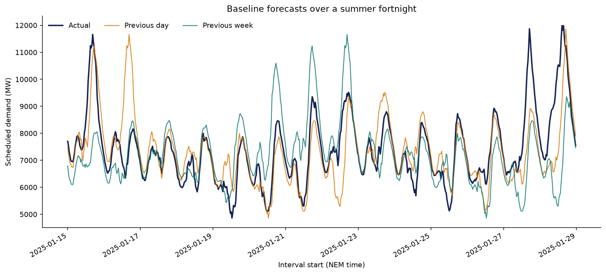

# Baseline forecast evaluation

## Evaluation design

- Historical development period: 2019–2023
- Validation period: 2024
- Final test period: 2025
- Previous-day forecast: demand from 48 half-hours earlier
- Previous-week forecast: demand from 336 half-hours earlier
- Peak-demand error: mean absolute error between actual and predicted daily maxima

## Results

| Period | Baseline | MAE (MW) | RMSE (MW) | MAPE | Daily peak MAE (MW) | Bias (MW) | Rows |
| --- | --- | ---: | ---: | ---: | ---: | ---: | ---: |
| Validation (2024) | Previous day | 494.6 | 740.5 | 6.58% | 555.3 | -1.5 | 17,568 |
| Validation (2024) | Previous week | 635.5 | 916.5 | 8.49% | 769.4 | -3.4 | 17,568 |
| Test (2025) | Previous day | 535.9 | 787.8 | 7.20% | 593.8 | 1.6 | 17,520 |
| Test (2025) | Previous week | 696.4 | 1,047.2 | 9.47% | 882.0 | 14.6 | 17,520 |

## Benchmark to beat

The stronger 2025 baseline is **Previous day**, with MAE **535.9 MW**,
RMSE **787.8 MW**, and MAPE **7.20%**.
Any advanced model should improve on this result using the same chronological
test period. The 2025 test results must not be used for model tuning.

