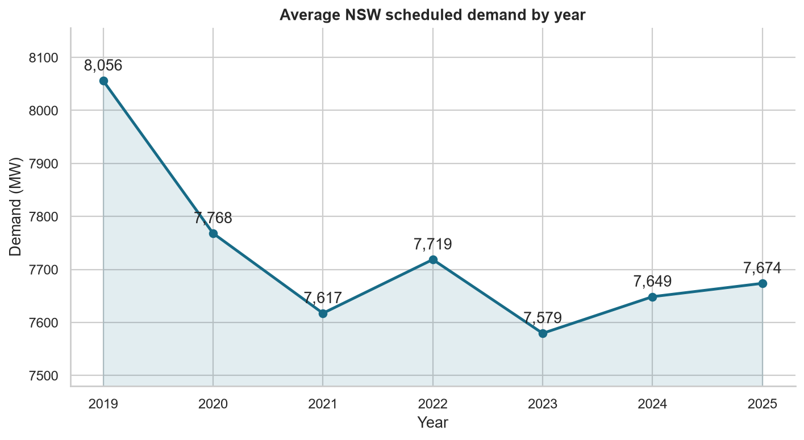
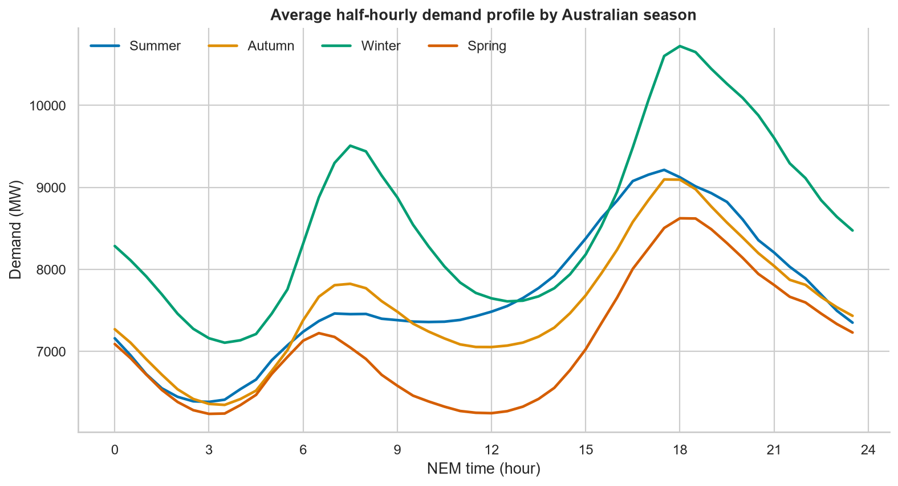
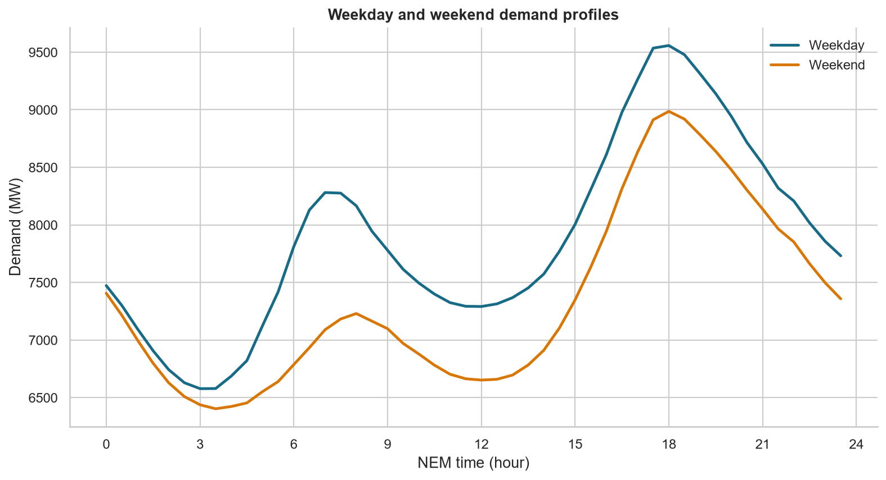
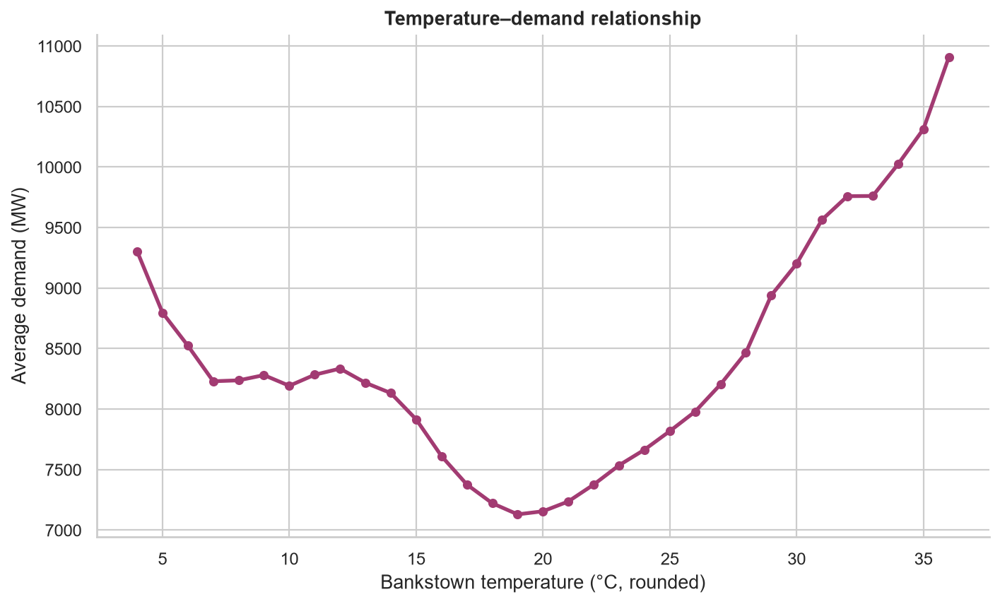
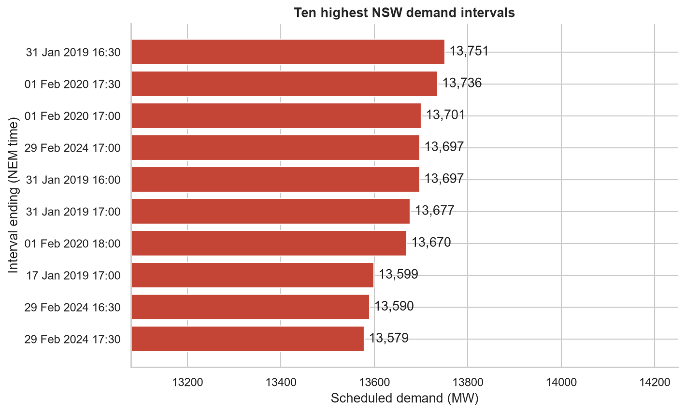

# Exploratory analysis: NSW scheduled demand

## Main findings

- Average demand was highest in **2019** (8,056 MW) and lowest in **2023** (7,579 MW).
- The maximum half-hour was **13,751 MW**, ending 31 January 2019 at 16:30 NEM time.
- At 18:00, weekday demand averages **572 MW** more than weekend demand.
- The summer average profile peaks around **17:30 NEM time**; the winter profile peaks around **18:00**.
- The highest temperature-bin mean occurs near **36°C**, supporting a nonlinear temperature effect.
- Public-holiday demand averages **9.3% lower** than non-holiday demand. This comparison is descriptive and not causal.

## Figures

## Interpretation limits

The weather series is ERA5 reanalysis for Bankstown Airport and acts as a proxy
for the broader NSW region. Aggregated patterns can combine weather, calendar,
economic, rooftop-solar, and structural effects. Forecast evaluation will use
chronological splits so future observations never leak into model training.
