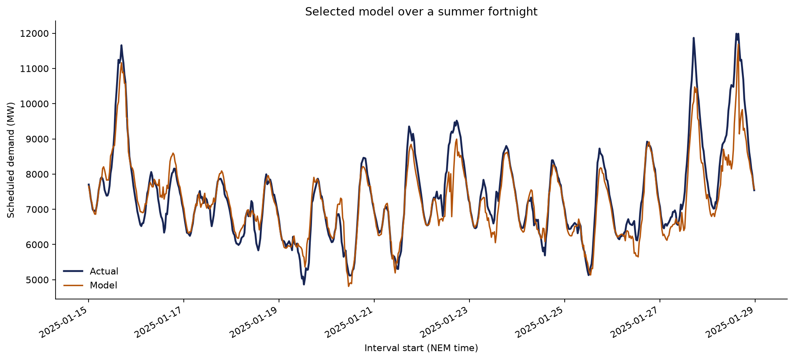

# Trained model results

## Model selection

Models were fitted on 2019–2023 and selected using 2024 only. **Gradient boosting**
had the lowest validation MAE, so it was refitted using 2019–2024 and evaluated
once on the 2025 test period.

| Model and period | MAE (MW) | RMSE (MW) | MAPE | Daily peak MAE (MW) | Bias (MW) |
| --- | ---: | ---: | ---: | ---: | ---: |
| Ridge regression — validation 2024 | 414.9 | 607.2 | 5.54% | 478.2 | 6.2 |
| Gradient boosting — validation 2024 | 257.3 | 364.4 | 3.55% | 219.3 | 36.3 |
| Gradient boosting — test 2025 | 279.4 | 391.3 | 3.78% | 246.6 | -40.9 |

## Result

The selected model's 2025 MAE is **279.4 MW**, an
**47.9% improvement** over the previous-day baseline MAE of 535.9 MW.
Its test RMSE is **391.3 MW**, MAPE is
**3.78%**, and daily peak MAE is
**246.6 MW**.

## Important limitation

Historical ERA5 reanalysis is used as a proxy for weather information that would
be available from a real forecast. This isolates the value of weather features
but can make performance optimistic compared with production, where weather
forecasts contain error. Demand lag features are restricted to one day and one
week, so they are available for a 24-hour-ahead forecast.
